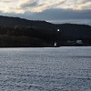

+++
title = "Photography"
date = "2018-01-07"
sidemenu = "true"
description = ""
+++

<link rel="stylesheet" href="css/blueimp-gallery.min.css">

<!-- The Gallery as lightbox dialog, should be a child element of the document body -->

    

    <h3 class="title"></h3>
    <a class="prev">‹</a>
    <a class="next">›</a>
    <a class="close">×</a>
    
    <ol class="indicator"></ol>

Photography is a hobby and a passion for me. I try to take my camera on various travels, hikes, and when I get  time with my family (especially for photos of the nephew and the dog). Here is a selection of some of my favorites, hosted via the open source [blueimp gallery](https://github.com/blueimp/Gallery/) scripts, and feel free to check out my [Instagram feed](https://www.instagram.com/m1ketreglia/). All photos are presented here copyrighted. If you are interested in prints, or using any of my photos publicly, on another website, etc., please reach out to me.

[Bergen, Norway - 2018](#norway2018) 

# 

## Bergen, Norway - 2018

    
    
    
    
    
    
    
    
    
    
    
    
    
	
	
	
	
	
	
	
	
	
	
	
	
		
	
		
	
		
	
		
	
		
	

	

