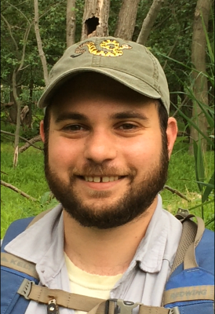

+++
title = "About"
date = "2018-01-07"
sidemenu = "true"
description = "About me and this site"
+++

<big><big><b><u>Education:</u></b></big></big></b>
 
There I taught courses on <a href="treglia_cv_20180107_norefs.pdf" target="_About">Click Here to view as a PDF</a>

<b>Doctor of Philosophy (2014) Texas A&amp;M
University, Department of Wildlife and Fisheries, Advised by Dr. Lee
Fitzgerald </b>
 
<b>Dissertation Title: Multi-Scale Conservation in an Altered Landscape: The Case of the Endangered Arroyo Toad in Southern California</b>
  
<b>Masters of Science (2010) Texas A&amp;M
University, Department of Wildlife and Fisheries, Advised by Dr. Lee
Fitzgerald </b>
<b>Thesis Title: A Translocated Population of the St. Croix Ground Lizard: Analyzing its Detection Probability and Investigating Its Impacts on the Local Prey Base (<a href="Treglia 2010_Thesis.pdf">Click Here to view as a PDF</a>)</b>
 
 
<b>
Bachelors of Science (2007) Cornell University, Department of
Natural Resources</b>

<big><big><b><u>A Bit About Me:</u></b></big></big> 
<b>I work as the Urban Spatial Planner for <a href="http://www.nature.org/ourinitiatives/regions/northamerica/unitedstates/newyork/places-preserves/new-york-city.xml" target="_About">The Nature Conservancy's New York City Program</a>. In this role I use GIS and Remote Sensing tools to characterize the current open space in the city, while thinking about how we can improve the state of biodiversity and develop resilience to climate change. I grew up in Staten Island, NY, and am delighted to now be working on conservation issues of my entire home city.
 
 
Prior to my current position I workd as a Postdoctoral Scholar at the University of Tulsa, with <a href="http://ronbonett.weebly.com/" target="_About">Dr. Ron Bonett</a> as part of the NSF-Funded <a href="http://www.okepscor.org/" target="_About">Oklahoma EPSCoR program</a>. There I taught courses on <a href="http://mltconsecol.github.io/TU_LandscapeAnalysis_Documents" target="_About"> spatial analysis </a>, conducted research on environmental drivers of alternative life histories in salamanders, and worked on preparing Oklahoma LiDAR data for use by other researchers in the state.
 
 
I completed my PhD at Texas A&amp;M University in the Department of Wildlife and Fisheries Sciences.  My general research interests are in the fields of landscape ecology and conservation biology, with an emphasis on amphibians and reptiles. My dissertation research focused on understanding how anthropogenic landscape alterations impact amphibians indirectly, through large-scale processes. I conducted this work as part of the <a href="http://biodiversity.tamu.edu" target="_About">Applied Biodiversity Sciences IGERT program</a> (NSF-Funded) at Texas A&M.
 
 
